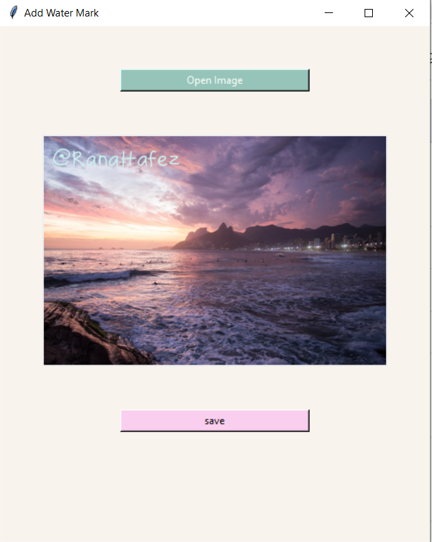

#Image Watermarking Desktop App

### This is a desktop app that adds my logo to locally stored images on my PC.

## Usage
* prompts the user to select an image
* provides the image with the logo
* prompts the user to either save the changes or cancel.

## Packages
* PIL
* tkinter

### @RanaHafez(2022)